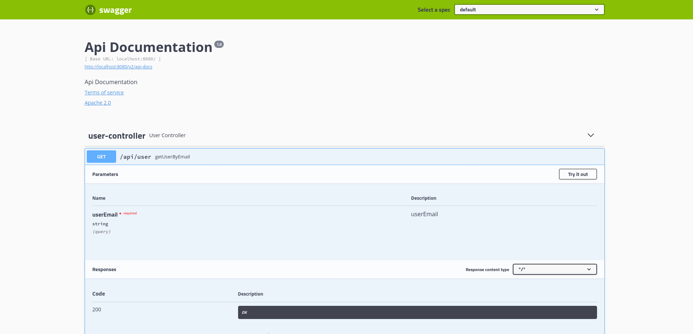
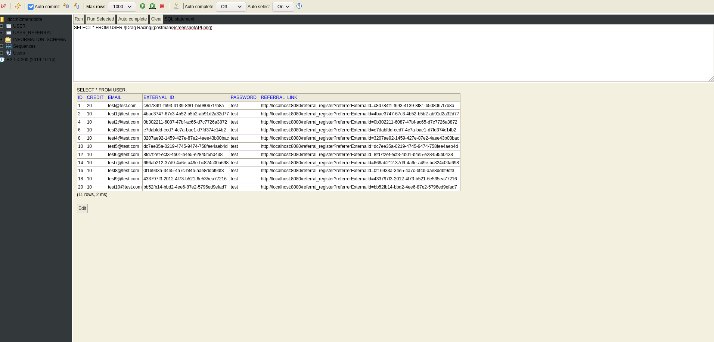
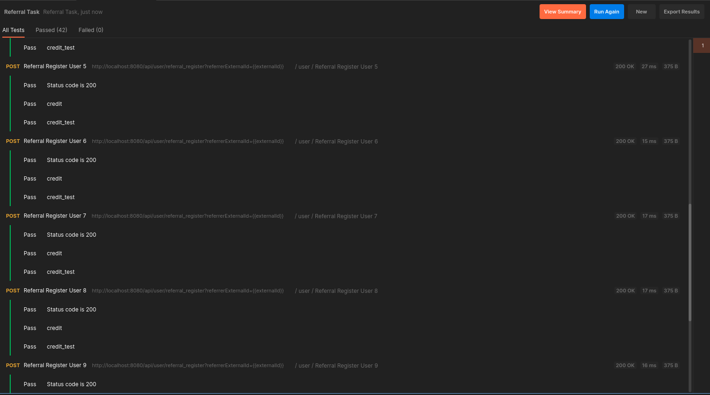

Referral Task
==========

Additional validation of models properties should be good to implement for requests, depending on requirements.
Frontend developer can replicate Postman requests in order to  implement API calls.
Update of existing user credit is done in transaction marked with annotation @Transactional.

### Development IDE 

I am using Intellij Idea Community edition. 

https://www.jetbrains.com/idea/download/

After IDE is installed you can import project as maven project. You would need to have maven installed locally or there is boundled version with IDE.

Regarding Java installation there is option after project is import to choose which you want to install.

When maven import is done and dependencies are resolved you can open ReferralTask.java and run/debug main method.
It will start rest API with h2 in memory database.
 

### API documentation links after project is started
 http://localhost:8080/swagger-ui.html
 
 http://localhost:8080/v2/api-docs
 
 

### Access h2 database on link below 
http://localhost:8080/h2-console

`Username: admin`

`Password: password`

### Example of requests and tests are available in Postman.

##### Import data like in example on the link below.

https://learning.postman.com/docs/getting-started/importing-and-exporting-data/#importing-data-into-postman

##### You can run collection tests like in example on the link below

https://learning.postman.com/docs/running-collections/intro-to-collection-runs/

Below is image of runner results.
File->New runner tab

If you put delay to 0 it will run requests in parallel. Won't make any delay between requests.

 